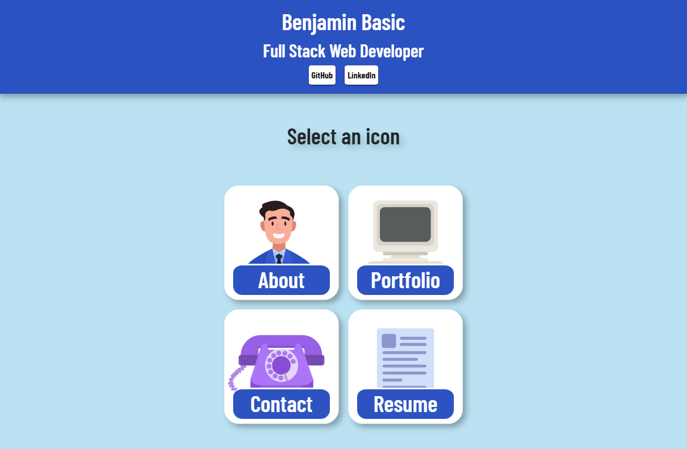
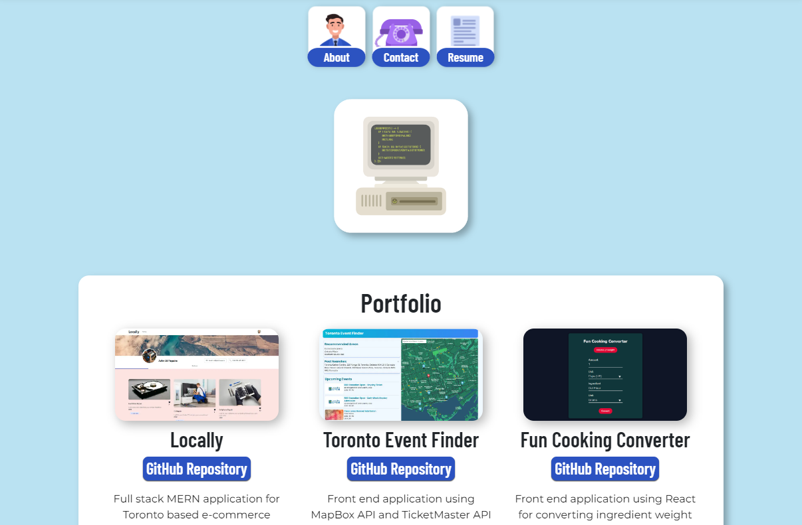

# Portfolio

  ## Description

  This is Portfolio made with React. Information about myself, examples of my work, a downloadable resume, and a contact form to get in touch with me are included in the deployed application.
 
  ## Table Of Contents

  - [Screenshots](#screenshots)
  - [Link (Deployed Application)](#link)
  - [Installation](#installation)
  - [Guidelines](#guidelines)
  - [Questions](#questions)

  ## Screenshots

  ## Link

https://benbasic.github.io/Portfolio-Ben-Basic/

  ## Installation

If you clone this repo and run it on your computer, you can install it doing the following in the terminal:

1) Type in npm i to install packages
2) Type in npm start
3) You are now free to view the portfolio, alternatively, it's much easier to click this link instead to view it https://benbasic.github.io/Portfolio-Ben-Basic/

  ## Questions

  This repo was created by https://github.com/BenBasic
  To contact me, please send an email to Benjamin@TreneonGames.com
